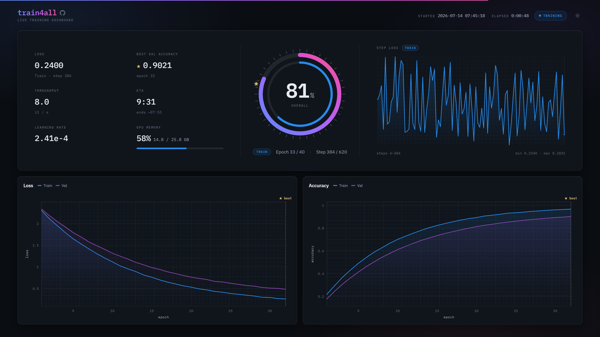
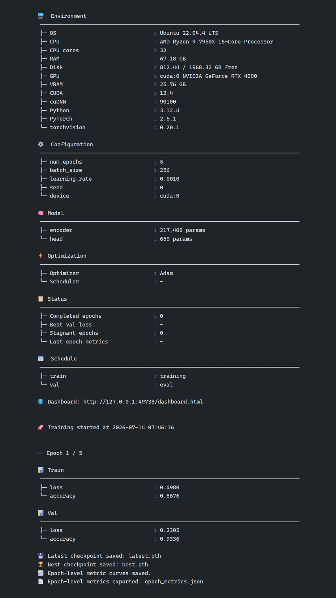
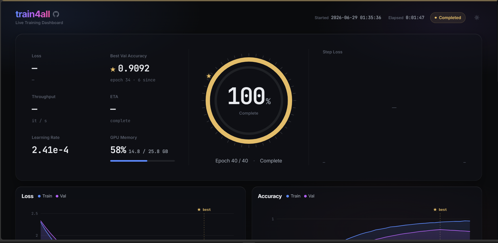

<div align="center">

# train4all


**Implement three methods. Get a complete training loop.**

<picture>
  <source media="(prefers-color-scheme: dark)"  srcset="assets/dashboard-dark.png">
  <source media="(prefers-color-scheme: light)" srcset="assets/dashboard-light.png">
  
</picture>

</div>

---

train4all is a minimal PyTorch training framework. Subclass `BaseTrainer`, implement `setup()`, `compute_loss()`, and `compute_metrics()` — the framework handles checkpointing, early stopping, metrics, logging, and a live web dashboard automatically.

**Features at a glance**

- **Zero boilerplate** — one subclass, three methods, full training loop
- **Mixed precision** — automatic bf16 AMP on CUDA by default for lower VRAM and faster steps; opt into `"fp16"` for older cards or disable with `amp=False`. TF32 + cuDNN autotuner switch on automatically for unseeded runs (`tf32`)
- **Scale on small GPUs** — gradient accumulation (`accumulation_steps`) simulates a larger effective batch at no extra memory cost, and per-model `torch.compile` (`compile=True`) unlocks graph-level speedups
- **Automatic checkpointing** — `latest.pth` and `best.pth` saved after every epoch; periodic saves every N epochs, plus a standalone `Checkpoint` reader to inspect any file with no model or subclass
- **Early stopping** — patience-based on any `monitor` metric (`min`/`max` mode), with automatic best-checkpoint tracking
- **Live web dashboard** — a self-contained, dependency-free panel: progress gauge, live KPIs, per-step loss graph, per-metric charts, light & dark themes
- **Flexible metrics** — epoch- and step-level recording, JSON export, matplotlib curve plots
- **Snapshot sync** — mirror `run_dir` to any path for cloud-backed storage during long runs
- **Lifecycle hooks** — 14 hook points to inject logic at any stage without subclassing the loop
- **Step cache** — share tensors between `compute_loss` and `compute_metrics` with no extra forward pass

---

## Contents

- [train4all](#train4all)
  - [Contents](#contents)
  - [Installation](#installation)
  - [Quick Start](#quick-start)
  - [Constructor Parameters](#constructor-parameters)
  - [API Reference](#api-reference)
    - [Abstract Methods](#abstract-methods)
      - [Optional: test-only metrics](#optional-test-only-metrics)
    - [Training \& Evaluation](#training--evaluation)
    - [Setup Helpers](#setup-helpers)
    - [Model Management](#model-management)
    - [Lifecycle Hooks](#lifecycle-hooks)
    - [Step Cache](#step-cache)
    - [Checkpointing](#checkpointing)
      - [Persisting custom state: `extras` vs. hooks](#persisting-custom-state-extras-vs-hooks)
      - [Inspecting a checkpoint](#inspecting-a-checkpoint)
    - [Metrics](#metrics)
      - [Weighted averaging](#weighted-averaging)
    - [Custom Training Loop](#custom-training-loop)
    - [State Inspection](#state-inspection)
    - [Configuration](#configuration)
    - [Snapshot](#snapshot)
    - [GPU Utilities](#gpu-utilities)
  - [Live Dashboard](#live-dashboard)
    - [DashboardConfig Parameters](#dashboardconfig-parameters)
  - [License](#license)

---

## Installation

```bash
pip install git+https://github.com/tomoking2004/train4all.git
```

---

## Quick Start

```python
import torch
import torch.nn as nn
import torch.nn.functional as F
from torch.utils.data import DataLoader, TensorDataset
from train4all import BaseTrainer


class MyTrainer(BaseTrainer):
    def setup(self):
        self.encoder = nn.Sequential(
            nn.Linear(784, 256), nn.ReLU(),
            nn.Linear(256,  64), nn.ReLU(),
        )
        self.head = nn.Linear(64, 10)

        self.set_models({"encoder": self.encoder, "head": self.head})
        self.set_optimizer(
            torch.optim.Adam(self.get_trainable_params(), lr=self.learning_rate)
        )

    def compute_loss(self, batch):
        x, y = batch
        logits = self.head(self.encoder(x))
        self.set_cache("logits", logits.detach())
        return F.cross_entropy(logits, y)

    def compute_metrics(self, batch):
        _, y = batch
        preds = self.get_cache("logits").argmax(dim=1)
        return {"accuracy": (preds == y).float().mean().item()}


def make_loader(n: int, batch_size: int = 64) -> DataLoader:
    x = torch.randn(n, 784)
    y = torch.randint(0, 10, (n,))
    return DataLoader(TensorDataset(x, y), batch_size=batch_size, shuffle=True)


trainer = MyTrainer(num_epochs=5, learning_rate=1e-3, run_dir="run", use_dashboard=True)
trainer.train(make_loader(100_000), val_loader=make_loader(20_000))
trainer.test(make_loader(10_000), use_best=True)
```

Running it opens the [live dashboard](#live-dashboard) and streams a clean console log — a reproducibility banner (environment, resolved config, model), then a per-phase metric table and automatic checkpoint saves on every epoch:

<div align="center">
  
</div>

---

## Constructor Parameters

Every parameter is optional, and all except `num_epochs` are **keyword-only**, so order never matters and the table can be reordered freely. The saved config records **only the reproducibility-relevant arguments you actually customized** — anything left at its default is omitted — and unpacks straight back in: [`MyTrainer.from_config("run")`](#configuration) reconstructs the trainer from the saved `config.json`. The **resolved `device`** is also pinned (e.g. `"cuda:0"`), so a reload targets the same hardware for exact reproduction and fails loudly on a host that lacks it (pass `device=` to retarget); purely operational args like `run_dir` are omitted and fall back to their defaults.

| Parameter | Default | Description |
| :-- | :-- | :-- |
| `num_epochs` | `None` | Total training epochs. Required by `train()`; leave unset to only evaluate (`test()`) or inspect checkpoints. |
| `batch_size` | `None` | Informational; accessible in `setup()` as `self.batch_size`. |
| `learning_rate` | `None` | Scalar or per-group dict; available as `self.learning_rate` in `setup()`. Leave unset for learning-rate-free optimizers (e.g. Prodigy, D-Adaptation, Schedule-Free); **pass it explicitly for optimizers that need one** (e.g. Adam, SGD), since `self.learning_rate` is `None` until you do. |
| `max_grad_norm` | `None` | Clip the global gradient norm to this value before each optimizer step. Disabled when `None`. Correct under fp16 AMP — gradients are unscaled first. |
| `accumulation_steps` | `1` | Accumulate gradients over this many steps before each optimizer update, simulating a larger effective batch with no extra memory. The accumulation is normalized as `Σ wᵢ∇Lᵢ / Σ wᵢ` with weights from `get_batch_weight`; this is the true mean over the effective batch only when the weight matches the loss's denominator (override to the token count for per-token losses — the default sample count fits a per-sample mean). For known-length loaders the last partial cycle of each epoch is always flushed. |
| `amp` | `None` | Automatic mixed precision. `None` auto-enables bf16 on CUDA (no-op on CPU/MPS); `True`/`"bf16"`/`"fp16"` requests it explicitly (warns if the device is not CUDA); `False` forces full precision. |
| `tf32` | `None` | Allow TF32 fp32 matmuls/convolutions and the cuDNN autotuner on CUDA (Ampere+). `None` auto-enables it only when `seed` is unset (speed when not reproducing); `True`/`False` force it. CUDA-only; complementary to `amp`. |
| `patience` | `None` | Early-stopping patience in epochs. Disabled when `None`. |
| `monitor` | `"loss"` | Validation metric driving best-checkpoint selection and early stopping. |
| `monitor_mode` | `"min"` | `"min"` (lower is better, e.g. loss) or `"max"` (higher is better, e.g. accuracy). |
| `training_phases` | `["train"]` | Phase names that trigger gradient updates. |
| `device` | auto | `"cuda"`, `"cuda:1"`, `"mps"`, or `"cpu"`. Auto-detected when `None` — prefers CUDA, then MPS, then CPU. On a multi-GPU machine, pick a specific GPU with `"cuda:<index>"`. |
| `seed` | `None` | Global random seed for Python, NumPy, and PyTorch. |
| `run_dir` | `"run"` | Output directory for checkpoints, metrics, logs, and plots. |
| `run_snapshot_dir` | `None` | Mirror directory for a lightweight copy of `run_dir` via `snapshot_run()`. |
| `resume` | `True` | Resume from `latest.pth` at the start of training. When `False`, `prepare_training()` first clears the run's previous artifacts (`checkpoints/`, `metrics/`, `plots/`, and dashboard files) and starts a fresh log, so a fresh run never inherits stale files — `config.json` and any user files in `run_dir` are kept, and evaluation-only flows (calling `test()` without training) are unaffected. |
| `save_interval` | `None` | Save a periodic checkpoint every N epochs. |
| `record_step_metrics` | `False` | Record per-step metrics during training phases. |
| `step_metric_names` | `None` | Subset of metric names to record at the step level. `None` records all. |
| `pbar_metric_names` | `None` | Metric names shown in the tqdm postfix. `None` hides all metrics (GPU memory still shown on CUDA). |
| `use_progress_bar` | `True` | Show tqdm progress bars during epoch iteration. |
| `debug_mode` | `False` | Enable debug-level logging. |
| `logger` | `None` | Any object satisfying the `TrainerLogger` protocol (a `log()` method); a default `UnifiedLogger` is created if `None`. |
| `use_dashboard` | `False` | Enable the live web dashboard. |
| `dashboard_config` | `None` | Dashboard appearance and behaviour (`DashboardConfig`). |

Purely cosmetic display settings are **class constants** rather than constructor arguments — set once per trainer type, not per run, so override them in your subclass: `_KEY_WIDTH` (column width for printed metric/summary tables, default `32`) and `_KEEP_PROGRESS_BAR` (keep tqdm bars on screen after each epoch, default `False`).

---

## API Reference

### Abstract Methods

Implement all three in your subclass:

```python
def setup(self) -> None:
    # Initialize and register models, optimizer, and scheduler.
    # Called once before training or evaluation begins.
    ...

def compute_loss(self, batch: Any) -> torch.Tensor:
    # Compute and return a scalar loss tensor.
    # The batch is already on the training device.
    ...

def compute_metrics(self, batch: Any) -> dict[str, float]:
    # Return a flat dict of metric name → scalar value.
    # Called immediately after compute_loss; the step cache is populated.
    # Used by train, val, and any custom phase.
    ...
```

#### Optional: test-only metrics

Train and validation share `compute_metrics` so the per-epoch path stays cheap. The **test** phase runs once for final reporting, so it has its own override for heavier, report-only metrics. The default delegates to `compute_metrics`, so test mirrors validation until you override it:

```python
def compute_test_metrics(self, batch: Any) -> dict[str, float]:
    metrics = self.compute_metrics(batch)        # reuse the shared metrics
    metrics["auc"] = roc_auc_score(...)          # plus report-only extras
    return metrics
```

Only the `"test"` phase (used by `trainer.test()`) routes here; every other phase uses `compute_metrics`.

---

### Training & Evaluation

```python
trainer.train(train_loader, val_loader=val_loader)
```

Run the full training loop. Calls `prepare_training()` first, then iterates epochs, runs validation after each train epoch when `val_loader` is provided, and handles early stopping, checkpointing, and dashboard updates automatically.

```python
metrics: dict[str, float] = trainer.test(test_loader, use_best=True)
```

Evaluate on a held-out test set. When `use_best=True`, loads the best **weights** from `best.pth` before running — use this for final reporting after `train()` completes. Only the weights are loaded, so evaluation never rewinds the epoch counter or truncates the recorded metric history to the best epoch (call `load_best_checkpoint()` for that deliberate full rewind). Per-step metrics come from `compute_test_metrics` (see above), so override it to report test-only metrics.

---

### Setup Helpers

Intended for use inside your `setup()` implementation:

```python
# Register models and move them to the training device.
self.set_models({"encoder": enc, "head": head})    # multiple at once
self.set_model("backbone", backbone)                # one at a time

# Optionally compile a model in place for graph-level speedups (PyTorch 2.0+).
# The registered module is compiled, so your compute_loss runs the optimized
# graph and checkpoints keep their original keys.
self.set_model("decoder", decoder, compile=True)

# Set the optimizer.
optimizer = torch.optim.AdamW(self.get_trainable_params(), lr=self.learning_rate)
self.set_optimizer(optimizer)

# Set a learning-rate scheduler (optional).
scheduler = torch.optim.lr_scheduler.CosineAnnealingLR(optimizer, T_max=self.num_epochs)
self.set_scheduler(scheduler)

# Collect all trainable parameters (deduplicated) from registered models.
params = self.get_trainable_params()

# Restrict to specific models, or exclude some.
params = self.get_trainable_params(targets="head", exclude_targets="encoder")
```

---

### Model Management

```python
self.freeze("encoder")             # disable gradients
self.unfreeze("encoder")           # re-enable gradients
self.reset_parameters("head")      # re-initialize weights in place

# Targets accept a name string, an nn.Module instance, or a list of either.
self.freeze(["encoder", self.head])
```

---

### Lifecycle Hooks

Override any of these no-ops to inject logic at any stage of the loop:

```python
# Training run
def on_training_start(self) -> None: ...
def on_training_end(self) -> None: ...
def on_exception(self, exc: BaseException) -> None: ...                # loop aborted; re-raised afterwards

# Epoch
def on_train_epoch_start(self, epoch: int) -> None: ...
def on_train_epoch_end(self, epoch: int) -> None: ...
def on_epoch_start(self, epoch: int | None, loader: DataLoader, phase: str) -> None: ...
def on_epoch_end(self, epoch: int | None, loader: DataLoader, metrics: dict[str, float], phase: str) -> None: ...

# Step
def on_step_start(self, step: int | None, batch: Any, phase: str) -> None: ...
def on_step_end(self, step: int | None, batch: Any, metrics: dict[str, float], phase: str) -> None: ...

# Optimization
def on_set_training_mode(self, training: bool) -> None: ...
def on_after_backward(self) -> None: ...                              # before unscale/clip (fp16 grads still scaled)
def on_before_optimizer_step(self) -> None: ...                       # after unscale/clip, before optimizer.step()

# Checkpoint (full checkpoints only, not weights-only)
def on_save_checkpoint(self, checkpoint: Checkpoint) -> None: ...      # attach custom state (checkpoint["ema"] = ...)
def on_load_checkpoint(self, checkpoint: Checkpoint) -> None: ...      # read it back after restore
```

A few timing guarantees worth knowing:

- The step cache is cleared **before** `on_epoch_start` fires.
- Epoch metrics for the completed phase are already recorded **before** `on_epoch_end` fires, so `get_epoch_metrics()` reflects the current epoch inside that hook.
- `on_exception` fires for any error — including `KeyboardInterrupt` (Ctrl-C) — and the exception is **re-raised** afterwards. No checkpoint is auto-saved, since a mid-epoch save would persist an incomplete state.
- `on_save_checkpoint` / `on_load_checkpoint` fire only for **full** checkpoints; weights-only saves/loads stay pure (models + extras). They pair with `update_checkpoint_extras()` for round-tripping custom state across a resume.

---

### Step Cache

`set_cache` and `get_cache` share tensors between `compute_loss` and `compute_metrics` within a single step, eliminating redundant forward passes:

```python
def compute_loss(self, batch):
    logits = self.model(batch["x"])
    self.set_cache("logits", logits.detach())    # store
    return F.cross_entropy(logits, batch["y"])

def compute_metrics(self, batch):
    preds = self.get_cache("logits").argmax(1)   # retrieve
    return {"acc": (preds == batch["y"]).float().mean().item()}
```

The cache is cleared automatically at the start of each epoch and phase, before `on_epoch_start` fires. Use `get_cache(key, default=...)` to supply a fallback when the key may be absent.

---

### Checkpointing

```python
# Saving
trainer.save_checkpoint("run/my_checkpoint.pth")         # full checkpoint at any path
trainer.save_weights("run/weights_only.pth")              # model weights only
trainer.backup_checkpoint("run/checkpoints/latest.pth")   # copy with .bak suffix

# Loading
trainer.load_latest_checkpoint()                          # load checkpoints/latest.pth
trainer.load_best_checkpoint()                            # full restore — rewinds to the best epoch
trainer.load_best_weights()                               # best weights only — no rewind (test uses this)
trainer.load_checkpoint("run/my_checkpoint.pth")          # full checkpoint from any path
trainer.load_weights("run/weights_only.pth")              # weights only, skip optimizer state

# Rename state-dict keys on the fly (useful when the model architecture changed).
trainer.load_checkpoint("old.pth", key_map={"old_prefix.": "new_prefix."})

# Querying
trainer.has_latest_checkpoint()
trainer.has_best_checkpoint()
path = trainer.get_latest_checkpoint_path()
path = trainer.get_best_checkpoint_path()
path = trainer.get_checkpoint_path("epoch_10")            # checkpoints/epoch_10.pth

# Extras
trainer.exclude_from_checkpoint("encoder")                # omit a model from future saves
trainer.update_checkpoint_extras({"notes": "baseline"})   # embed custom data in the file
extras = trainer.get_checkpoint_extras()                  # read it back (restored on load)
```

#### Persisting custom state: `extras` vs. hooks

Two mechanisms embed your own data in a checkpoint. They are complementary — pick by whether the data is static metadata or dynamic state:

| | `update_checkpoint_extras()` | `on_save_checkpoint()` / `on_load_checkpoint()` |
| :-- | :-- | :-- |
| Nature | **Declarative** — set the value once, when you know it | **Imperative** — runs on every save, capturing the current value |
| Scope | Rides along with **full *and* weights-only** saves | **Full checkpoints only** |
| Round-trip | Automatic (restored into `get_checkpoint_extras()`) | You write the paired save/load logic yourself |
| Best for | Static metadata: git SHA, class names, normalization constants, dataset version | Dynamic state needing custom serialization: EMA weights, RNG state, replay buffers |

```python
def setup(self):
    ...
    self.update_checkpoint_extras({"class_names": CLASSES})   # static — set once

def on_save_checkpoint(self, checkpoint):
    checkpoint["ema"] = self.ema.state_dict()                 # dynamic — captured each save

def on_load_checkpoint(self, checkpoint):
    if "ema" in checkpoint:
        self.ema.load_state_dict(checkpoint["ema"])
```

The hook receives a [`Checkpoint`](#inspecting-a-checkpoint): index it like a dict (`checkpoint["ema"]`, `"ema" in checkpoint`) or reach for its typed accessors.

#### Inspecting a checkpoint

`Checkpoint` reads a saved file and exposes its contents — **no model, no subclass, no abstract methods**. It is also the single source of truth for the on-disk format, so a trainer and an inspector never disagree about the schema.

```python
from train4all import Checkpoint

ckpt = Checkpoint.load("run/checkpoints/best.pth")   # map_location="cpu" by default
ckpt.print_summary()                  # tree: version, models + param counts, components, training state, metrics

ckpt.version                          # on-disk format version
ckpt.models["encoder"]                # a raw state dict — no architecture required
ckpt.model_summary()                  # {name: {"parameters": int, "tensors": int}}
ckpt.training_state["best_epoch"]     # legacy key names normalized automatically
ckpt.extras                           # custom metadata embedded via update_checkpoint_extras()
ckpt.metrics                          # recorded {"epoch_metrics": ..., "step_metrics": ...}
ckpt.optimizer_state                  # None for a weights-only checkpoint
ckpt.raw                              # the underlying dict, for anything not surfaced above
```

---

### Metrics

```python
# Epoch-level
table = trainer.get_epoch_metrics()                       # dict[metric, dict[phase, list[float]]]
table = trainer.get_epoch_metrics(metric_names=["loss"], phases=["val"])
path  = trainer.export_epoch_metrics()                    # writes metrics/epoch_metrics.json
        trainer.save_epoch_metric_plots()                 # writes plots/*.png via matplotlib

# Step-level (requires record_step_metrics=True)
table = trainer.get_step_metrics()
table = trainer.get_step_metrics(phases=["train"])
path  = trainer.export_step_metrics()                     # writes metrics/step_metrics.json
        trainer.save_step_metric_plots()

# Resetting
trainer.clear_metrics()                                   # reset both epoch and step tables
```

#### Weighted averaging

Epoch metrics are sample-weighted averages — `Σ(metric × weight) / Σweight` across the steps in an epoch — so uneven final batches are weighted correctly. Each batch's weight defaults to its sample count; override `get_batch_weight` to weight by the loss's denominator instead, e.g. the supervised-token count for a language/vision-language model whose loss is a mean over `labels != -100`. The same weight also normalizes the accumulated gradient when `accumulation_steps > 1`, so loss and gradient stay consistently weighted:

```python
def get_batch_weight(self, batch: Any) -> int:
    # HF LM/VLM loss is a mean over labels != -100; weight must match.
    return int((batch["labels"] != -100).sum())
```

---

### Custom Training Loop

When you need more control than `train()` provides, build your own loop using the building blocks:

```python
trainer.prepare_training()  # print env, save config, run setup(), optional resume

for epoch, max_epoch in trainer.epoch_iterator():
    train_metrics = trainer.execute_epoch(train_loader, phase="train")
    val_metrics   = trainer.execute_epoch(val_loader,   phase="val")

    trainer.finalize_train_epoch(val_metrics.get(trainer.monitor))
    trainer.save_artifacts()   # checkpoints + metric plots + JSON export

    if trainer.should_stop_early():
        break
```

For step-level control:

```python
metrics = trainer.execute_epoch(loader, phase="train", print_metrics=True)
metrics = trainer.execute_step(batch,  phase="val",   print_metrics=True)
```

Both building blocks honor `accumulation_steps`: `execute_epoch` flushes each cycle automatically, and `execute_step` updates the optimizer on every `accumulation_steps`-th `step` you pass:

```python
for i, batch in enumerate(train_loader, 1):
    trainer.execute_step(batch, phase="train", step=i)
```

---

### State Inspection

```python
trainer.is_training_complete()       # True when current_epoch >= num_epochs
trainer.is_best_epoch()              # True if this epoch set the best monitored value
trainer.should_stop_early()          # True if patience is exhausted

trainer.print_status()               # epoch counter, best monitored value, recent metrics
trainer.print_model_summary()        # model names and parameter counts
trainer.print_env_summary()          # OS, CPU, RAM, GPU, Python, PyTorch versions
trainer.print_optimization_summary() # optimizer, scheduler, and gradient accumulation
```

---

### Configuration

```python
# Merge custom entries into the trainer config (persisted in config.json).
trainer.update_config({"experiment": "baseline", "tag": "v1"})
trainer.save_config()

path = trainer.get_config_path()     # run/config.json
```

`config.json` is the one run artifact that lives *outside* the checkpoint — everything else (metrics, plots) reconstructs from the `.pth`. `from_config` is its inverse, rebuilding an equivalently configured trainer straight from the file:

```python
trainer = MyTrainer.from_config("run")                # or "run/config.json"
trainer = MyTrainer.from_config("run", device="cpu")  # overrides replace file values
```

Only `BaseTrainer` constructor arguments are consumed, so custom metadata added via `update_config` is ignored; a subclass's own constructor arguments (model hyperparameters, …) are not in the base config and must be passed as overrides.

---

### Snapshot

Copy a lightweight snapshot of `run_dir` into a mirror location at any time — useful for syncing to a cloud-backed folder during long runs:

```python
trainer = MyTrainer(
    num_epochs=50,
    run_dir="run",
    run_snapshot_dir="/mnt/gdrive/experiments/run",
)

# Or call manually:
trainer.snapshot_run(exclude=["checkpoints"])
```

---

### GPU Utilities

```python
trainer.print_gpu_temperature()  # reads temperature via nvidia-smi; warns above 85 °C
trainer.empty_cuda_cache()       # gc.collect() + torch.cuda.empty_cache()
```

---

## Live Dashboard

Pass `use_dashboard=True` for a live, dependency-free dashboard in your browser: an overall-progress gauge, a KPI grid (loss, best validation, throughput, ETA, learning rate, GPU memory), a live per-step loss graph, and a per-metric SVG chart for each metric. It follows your light/dark theme and embeds its data inline so it stays viewable offline.

<div align="center">
  
</div>

> **Remote training** works headless and reports the remote GPU. From an editor (VS Code Remote-SSH, Dev Containers, WSL) it opens in your **local** browser automatically; over plain SSH, set `open_on_start=False` and forward the printed port (`ssh -L 8080:127.0.0.1:<printed-port> …`).

```python
from train4all import BaseTrainer, DashboardConfig

trainer = MyTrainer(
    num_epochs=50,
    use_dashboard=True,
    dashboard_config=DashboardConfig(
        poll_interval_ms=500,
        open_on_start=True,
    ),
)
```

### DashboardConfig Parameters

| Parameter | Default | Description |
| :-- | :-- | :-- |
| `enabled` | `True` | Master switch; `False` disables the dashboard entirely. |
| `filename` | `"dashboard.html"` | HTML shell filename written inside `run_dir`. |
| `data_filename` | `"dashboard_data.json"` | JSON data file polled by the browser. |
| `poll_interval_ms` | `500` | Browser polling interval in milliseconds. |
| `open_on_start` | `True` | Open in the system's default browser when training begins. |
| `stale_after_ms` | `30000` | Mark the run **Offline** after this many ms without a heartbeat. An absolute liveness timeout, independent of `poll_interval_ms` — size it above your slowest synchronous pause (large checkpoint saves, heavy plotting). |
| `use_server` | `True` | Start a local HTTP server (required for Chrome/Edge on `file://` pages). |

---

## License

[MIT](LICENSE) © 2026 tomoking2004
